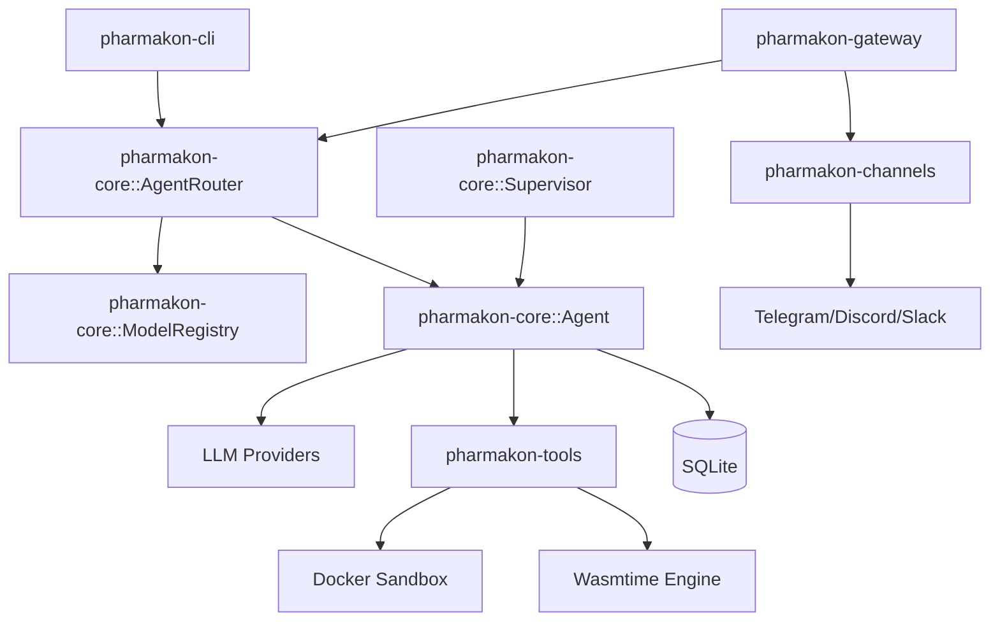

# Pharmakon Architecture

This document describes the high-level design and data flow of Pharmakon.

## 🏗️ Core Philosophy

Pharmakon is designed to be:
1. **Local-First**: Sensitive data and processing stay on your machine whenever possible.
2. **Modular**: Features are decoupled into crates to ensure maintainability and testability.
3. **Secure**: Strict isolation for external tool execution and encrypted secret storage.

## 🗺️ Component Diagram

## 🧩 Key abstractions

### AgentRouter
The central coordinator for loading and managing agents. It handles:
- **Dynamic Model Loading**: Using the `ModelRegistry` to instantiate models by name (e.g., `openai:gpt-4o`).
- **Fallback Logic**: If a requested model is unavailable (e.g., missing API key), the router automatically falls back to a pre-configured default model.
- **Persistence Mapping**: Linking agents to their respective SQLite session stores.

### Supervisor & Multi-Agent Teams
The `Supervisor` enables complex task decomposition by orchestrating multiple specialized agents.
- **Goal Decomposition**: A high-level goal is assigned to the supervisor.
- **Delegation**: Agents use the `send_message` tool to hand off sub-tasks to other agents in the team.
- **Resolution**: The `final_answer` tool is used to consolidate results and report back to the user.

## 🔄 Event-Driven Flow

Pharmakon uses a centralized event stream (`broadcast::Sender<Event>`) inside the `Agent` to notify subscribers of state changes.

1. **Input**: A message arrives from a Channel or the CLI.
2. **Thought**: The `Agent` sends the prompt to the `Model`. The `AgentThought` event is emitted.
3. **Action**: If the Model calls a tool, a `ToolCall` event is emitted.
4. **Approval**: For risky tools, the `Agent` pauses and emits an `ApprovalRequest`. The Gateway routes this to connected WebSocket clients.
5. **Execution**: Once approved, the `Tool` is executed (often in a `DockerSandbox`).
6. **Result**: The result is sent back to the Model, and a `ToolResult` event is emitted.
7. **Response**: The final response is delivered back to the original source.

## 🔒 Security Model

### Docker Sandboxing
All shell commands are executed via `bollard` in a transient Docker container.
- **Image**: Defaults to `alpine:latest` with `ripgrep` installed.
- **Isolation**: No host network or volume mounts by default.
- **Lifecycle**: Container is created, command runs, container is destroyed.

### Secret Management
We use the `keyring` crate to store API tokens.
- **Storage**: macOS Keychain, Linux Secret Service, or Windows Credential Manager.
- **Fallback**: Environment variables can be used for CI/CD or quick testing.

### Tool Approval
The `Agent` maintains a registry of "risky" tools. When one is invoked, the execution loop enters a wait state until a `ProvideApproval` request is received via the WebSocket gateway or CLI input.
