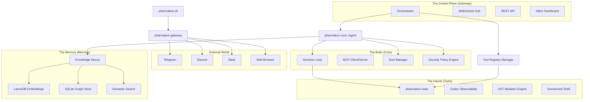

# Pharmakon System Architecture

This document describes the high-level design, component boundaries, and data flow of the Pharmakon Personal AI Engineering OS.

## 🏗️ Core Philosophy

Pharmakon is designed around four pillars:
1. **Local-First Reliability**: Sensitive data and heavy processing (AST indexing, vector search) remain on the user's machine.
2. **Deterministic Engineering**: Tools like execution traces and replaying ensure agent behavior is observable and reproducible.
3. **Epistemic Integrity**: A structured memory system (Knowledge Nexus) that handles contradictions and validates learned facts.
4. **Sandboxed Safety**: Progressive isolation for tool execution, ranging from local dry-runs to ephemeral Docker containers.

## 🗺️ Component Diagram (C4-Style)

## 🧩 Crate Responsibilities

### `pharmakon-core` (The Brain)
The central nervous system of Pharmakon.
- **Decision Loop**: The main `async` iteration that handles LLM completions, tool calls, and parallel context gathering.
- **Soul Management**: Defines the agent's personality, constraints, and instructions via Markdown-based "Soul" files.
- **Security Policy**: An extensible engine that evaluates tool calls against safety rules (Allow, Deny, RequireApproval).
- **Integrated MCP**: Native support for the Model Context Protocol to bridge with external tool servers.

### `pharmakon-memory` (The Memory)
A sophisticated multi-layered storage system.
- **Knowledge Nexus**: Combines vector embeddings (LanceDB) with relational graph data (SQLite) for hybrid RAG.
- **Epistemic Validation**: Handles contradictory information by prioritizing the "Single Source of Truth" (the current codebase state).
- **Access-Aware Decay**: Memories lose "decay_score" over time if not accessed, but high-access nodes receive "decay suppression" to prevent loss of critical architectural knowledge.

### `pharmakon-tools` (The Hands)
A unified interface for agent interactions with the world.
- **Codex OS Tools**: Execution Trace, Deterministic Replay, and Dry-Run simulation.
- **Engineering Tools**: AST-native mutation, LSP bridging, RepoMap generation, and Git management.
- **Standard Tools**: Browser automation, file system access, and web search.

### `pharmakon-gateway` (The Senses & Voice)
The primary entry point for all external communication.
- **Multi-Channel Hub**: Unified interface for Telegram, Discord, and Slack bots.
- **Real-time Dashboard**: A high-performance web UI for monitoring agent thoughts, tool traces, and health stats.
- **Tool Orchestration**: Responsible for initializing tools from `pharmakon-tools` and registering them with the `Agent`.

## 🔄 Interaction Flow: The Decision Loop

Pharmakon uses a structured loop for each interaction:

1. **Input**: A message arrives via a Gateway channel.
2. **Parallel Context Gathering**: The Agent simultaneously queries the Knowledge Nexus, Semantic Search, and Working Memory.
3. **Plan Retrieval**: The Agent decides on a RAG strategy (Simple, Hybrid, or Deep Research).
4. **Decision Turn**:
   - The Agent sends the context and goal to the Model.
   - If the Model calls tools, they are executed (potentially in parallel).
   - If a tool is "risky", the Gateway pauses for User Approval.
5. **Execution Trace**: Every thought and tool call is appended to a structured trace for later analysis.
6. **Self-Correction**: If tools fail, the error is fed back to the Model in the next turn to allow for autonomous recovery.
7. **Response**: The final answer is delivered to the user.
8. **Reflection Cycle**: Periodically (or upon task completion), the Agent reflects on the interaction to extract new facts and update `PHARMAKON.md`.

## 🔒 Security & Reliability

- **Dry-Run Mode**: Destructive tools (Shell, File Write) can be executed in "simulation mode" to verify output without side effects.
- **Docker Isolation**: Shell commands run in transient, network-isolated Docker containers.
- **Circular Dependency Guard**: The architecture is strictly layered (`common` -> `memory` -> `core` -> `tools` -> `gateway` -> `cli`) to ensure maintainability and prevent compile-time cycles.
- **MPSC Memory Actor**: (Planned) A single-actor model for memory access to prevent SQLite locking issues and ensure atomic updates.
